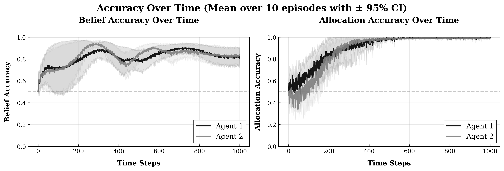
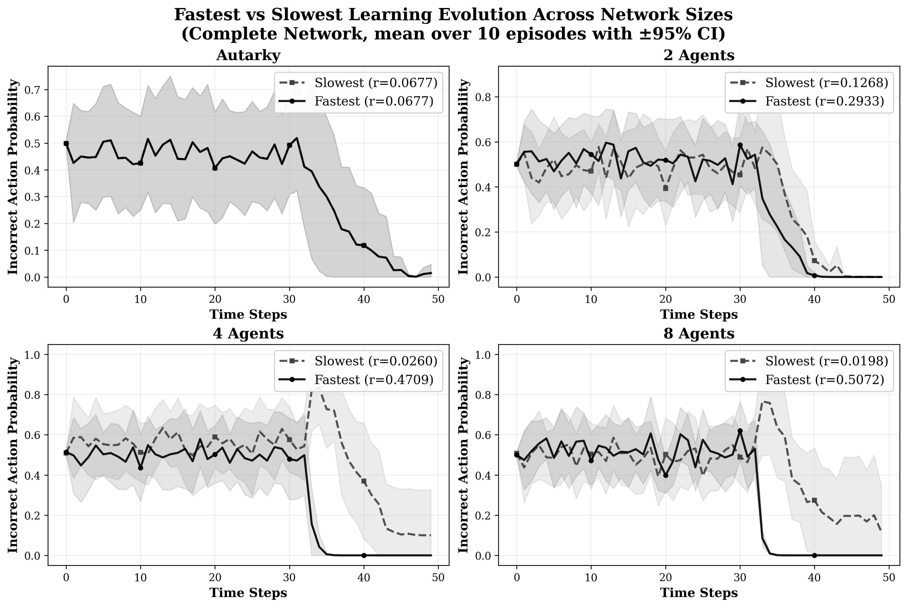
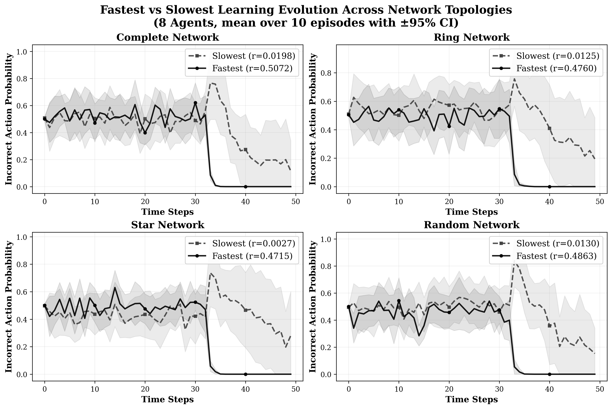
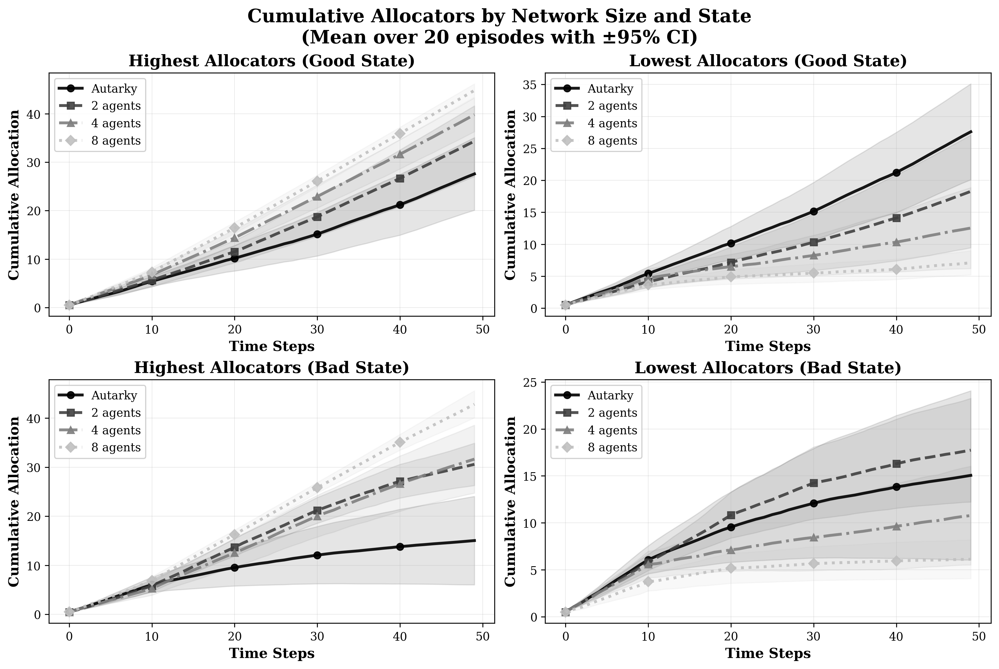

# POLARIS

<div align="center">

**P**artially **O**bservable **L**earning with **A**ctive **R**einforcement **I**n **S**ocial Environments

*A multi-agent reinforcement learning framework for strategic social learning*

[](https://www.python.org/downloads/)
[](https://pytorch.org/)
[](LICENSE)
[](https://github.com/psf/black)

[Quick Start](#-quick-start) • [Examples](#-examples) • [Research Features](#-research-features)

</div>

---

## Overview

POLARIS is a multi-agent reinforcement learning framework for studying **strategic social learning**. It implements two canonical environments from economic theory and provides sophisticated neural architectures for modeling how agents learn from both private signals and social observations.

### Theoretical Foundation

POLARIS introduces **Partially Observable Active Markov Games (POAMGs)**, extending traditional multi-agent frameworks to handle strategic learning under partial observability. Key theoretical contributions include:

- **Convergence Guarantees**: Stochastically stable distributions ensure well-defined limiting behavior
- **Policy Gradient Theorems**: Novel gradients for belief-conditioned policies in non-stationary environments  
- **Active Equilibrium Concepts**: Strategic reasoning about influencing others' learning processes

**[Read the full theoretical treatment →](docs/thesis.pdf)**

### Key Findings

Our research reveals several important insights about strategic social learning:

1. **Dynamic Role Assignment**: Agents naturally differentiate into complementary roles:
   - Information generators who engage in more exploratory behavior
   - Information exploiters who benefit from others' exploration
   
2. **Network Effects**: Learning dynamics vary significantly with network structure:
   - Complete networks show largest performance gaps between fastest and slowest learners
   - Ring networks exhibit more uniform learning rates
   - Star networks create pronounced differences between central and peripheral agents

3. **Efficiency Outcomes**: Contrary to traditional economic predictions:
   - Free-riding behavior does not lead to uniform inefficiencies
   - Some agents achieve performance exceeding autarky levels in larger networks
   - Collective information processing enhances overall learning


*Learning dynamics in strategic experimentation showing convergence to state-dependent optimal strategies*


*Learning trajectories across different network sizes, revealing systematic performance differences*


*Impact of network topology on learning dynamics, showing how information flow affects performance*


*Emergence of dynamic roles through allocation patterns across different network sizes*

### Key Features

- **Theoretical Foundation**: Based on Partially Observable Active Markov Games (POAMGs)
- **Strategic Learning**: Agents influence others' learning processes under partial observability
- **Advanced Architectures**: Graph Neural Networks with Temporal Attention and Transformers 
- **Continual Learning**: Synaptic Intelligence prevents catastrophic forgetting
- **Two Environments**: Brandl social learning and Keller-Rady strategic experimentation

## Quick Start

### Installation

```bash
# Basic installation
pip install polaris-marl

# With all features (recommended)
pip install polaris-marl[all]
```

### Command Line Usage

**General Purpose Simulation**
```bash
# Social learning experiment (Brandl framework)
polaris-simulate --environment-type brandl --num-agents 5 --num-states 3 --signal-accuracy 0.8

# Strategic experimentation (Keller-Rady framework)
polaris-simulate --environment-type strategic_experimentation --num-agents 4 --continuous-actions
```

**Research Scripts**
```bash
# Brandl social learning sweep - analyzes individual agent performance across network topologies
python experiments/brandl_sweep.py --agent-counts 1 2 4 6 8 --network-types complete ring star random --episodes 5

# Keller-Rady strategic experimentation sweep - compares aggregate performance across agent counts
python experiments/keller_rady_sweep.py --agent-counts 2 3 4 5 6 7 8 --episodes 3

# Individual experiments
python experiments/brandl_experiment.py --agents 8 --signal-accuracy 0.75 --plot-states
python experiments/keller_rady_experiment.py --agents 2 --horizon 10000 --plot-allocations

# List all available scripts
python -m polaris.experiments
```

### Python API

```python
from polaris.config.experiment_config import (
    ExperimentConfig, AgentConfig, TrainingConfig, BrandlConfig
)
from polaris.environments.social_learning import SocialLearningEnvironment
from polaris.training.simulation import run_experiment

# Create configuration
config = ExperimentConfig(
    agent=AgentConfig(
        learning_rate=1e-3,
        use_si=True,  # Enable Synaptic Intelligence
        num_gnn_layers=3  # Graph Neural Networks (default architecture)
    ),
    training=TrainingConfig(
        num_episodes=10,
        horizon=1000
    ),
    environment=BrandlConfig(
        num_agents=5,
        num_states=3,
        signal_accuracy=0.8,
        network_type='complete'
    )
)

# Create environment
env = SocialLearningEnvironment(
    num_agents=config.environment.num_agents,
    num_states=config.environment.num_states,
    signal_accuracy=config.environment.signal_accuracy,
    network_type=config.environment.network_type
)

# Run experiment
episodic_metrics, processed_metrics = run_experiment(env, config)
```

## Research Features

### Environments

**Brandl Social Learning**: Agents learn about a hidden state through private signals and social observation
- Discrete actions, configurable network topologies, theoretical bounds analysis
- Learning barriers and coordination benefits in different network structures
- Dynamic role assignment between information generators and exploiters

**Strategic Experimentation (Keller-Rady)**: Agents allocate resources between safe and risky options
- Continuous actions, Lévy processes, exploration-exploitation trade-offs
- State-dependent optimal allocation strategies
- Collective information processing through social learning

### Neural Architectures

- **Graph Neural Networks**: Temporal attention over social networks
  - Captures dynamic information flow patterns
  - Enables effective social learning across different network topologies
- **Transformers**: Advanced belief state processing
  - Handles partial observability through sophisticated belief updates
  - Maintains strategic coherence beyond individual signal observation
- **Variational Inference**: Opponent modeling and belief updating
  - Models evolving strategies of other agents
  - Enables strategic reasoning about others' learning processes

### Advanced Features

```bash
# Graph Neural Networks with temporal attention
polaris-simulate --gnn-layers 3 --attn-heads 8 --temporal-window 10

# Continual learning with Synaptic Intelligence
polaris-simulate --use-si --si-importance 150.0

# Custom network topologies
polaris-simulate --network-type ring --network-density 0.3
```

### Sweep Analysis Scripts

POLARIS provides specialized sweep scripts for comprehensive research analysis:

#### **Brandl Social Learning Sweep**

Analyzes individual agent learning performance across network topologies:

```bash
# Basic usage - analyze learning across network sizes and types
python experiments/brandl_sweep.py

# Custom configuration with statistical analysis
python experiments/brandl_sweep.py \
    --agent-counts 1 2 4 6 8 10 \
    --network-types complete ring star random \
    --episodes 5 \
    --horizon 100 \
    --signal-accuracy 0.75
```

**Key Features:**
- **Learning Rate Calculation**: Computes individual learning rates using log-linear regression
- **Statistical Analysis**: Multiple episodes with 95% confidence intervals
- **Extreme Agent Focus**: Shows fastest (green) and slowest (red) learners to avoid overcrowding
- **Network Topology Comparison**: Analyzes performance across complete, ring, star, and random networks

**Generated Outputs:**
- `fastest_slowest_network_sizes_evolution.png` - Performance trajectories across network sizes
- `fastest_slowest_network_types_evolution.png` - Performance trajectories across network types
- `agent_performance_results.json` - Complete numerical results with learning rates

#### **Keller-Rady Strategic Experimentation Sweep**

Compares aggregate performance across different agent counts:

```bash
# Basic usage - compare performance across agent counts
python experiments/keller_rady_sweep.py

# Custom configuration  
python experiments/keller_rady_sweep.py \
    --agent-counts 2 3 4 5 6 7 8 \
    --episodes 3 \
    --horizon 100
```

**Key Features:**
- **Multi-Agent Comparison**: Analyzes how performance scales with agent count
- **Statistical Analysis**: Confidence intervals across multiple episodes
- **Cumulative Allocation Tracking**: Resource allocation patterns over time
- **Convergence Analysis**: Studies optimal strategy convergence

**Generated Outputs:**
- `unified_accuracy_over_time.png` - Learning dynamics and convergence patterns
- `unified_cumulative_allocators.png` - Allocation trends with confidence intervals

## Examples

### Research Workflow
```bash
# 1. Individual agent analysis (Brandl social learning)
python experiments/brandl_sweep.py --agent-counts 2 4 6 8 --network-types complete ring star --episodes 5

# 2. Multi-agent comparison (Keller-Rady strategic experimentation)
python experiments/keller_rady_sweep.py --agent-counts 2 3 4 5 6 7 8 --episodes 3

# 3. Single experiments with visualization
python experiments/brandl_experiment.py --agents 8 --signal-accuracy 0.75 --plot-states --latex-style
python experiments/keller_rady_experiment.py --agents 2 --horizon 10000 --plot-allocations
```

### Advanced Configuration
```python
from polaris.config.experiment_config import ExperimentConfig, AgentConfig, TrainingConfig, StrategicExpConfig

# Strategic experimentation with continual learning
config = ExperimentConfig(
    agent=AgentConfig(
        use_si=True,  # Enable Synaptic Intelligence for continual learning
        si_importance=100.0,  # Importance weight for preventing catastrophic forgetting
        num_gnn_layers=3,  # Graph Neural Network layers for social learning
        temporal_window_size=10  # Window for temporal attention
    ),
    training=TrainingConfig(
        num_episodes=10, 
        horizon=1000
    ),
    environment=StrategicExpConfig(
        num_agents=4,
        continuous_actions=True,
        safe_payoff=1.0,
        drift_rates=[-0.5, 0.5]  # Good and bad state drift rates
    )
)
```

### Key Research Scenarios

1. **Learning Barriers Analysis**
```bash
# Analyze learning barriers across network sizes
python experiments/brandl_sweep.py \
    --agent-counts 4 8 16 32 \
    --network-types complete \
    --episodes 10 \
    --signal-accuracy 0.75 \
    --plot-learning-rates
```

2. **Dynamic Role Assignment Study**
```bash
# Study role emergence in strategic experimentation
python experiments/keller_rady_experiment.py \
    --agents 8 \
    --horizon 10000 \
    --plot-allocations \
    --track-roles
```

3. **Network Topology Impact**
```bash
# Compare learning dynamics across network structures
python experiments/brandl_sweep.py \
    --agent-counts 8 \
    --network-types complete ring star random \
    --episodes 5 \
    --plot-network-effects
```

## Available Scripts

| Script | Purpose | Key Features |
|--------|---------|-------------|
| `polaris-simulate` | General experimentation | Flexible interface for both environments |
| `experiments/brandl_experiment.py` | Single Brandl experiment | Belief analysis, state plots, learning barriers |
| `experiments/keller_rady_experiment.py` | Single strategic experiment | Allocation plots, role assignment analysis |
| `experiments/brandl_sweep.py` | Multi-agent Brandl analysis | Learning rates, network topology comparison |
| `experiments/keller_rady_sweep.py` | Multi-agent strategic analysis | Cumulative allocations, scaling analysis |

## Project Structure

```
polaris/
├── agents/          # Agent implementations with memory systems
│   ├── belief.py    # Belief state processing and updates
│   ├── memory.py    # Experience replay and continual learning
│   └── policy.py    # Policy networks with social learning
├── algorithms/      # Regularization techniques (SI, EWC)
│   ├── si.py        # Synaptic Intelligence implementation
│   └── ewc.py       # Elastic Weight Consolidation
├── config/          # Configuration system
│   ├── agent_config.py      # Agent hyperparameters
│   ├── env_config.py        # Environment settings
│   └── training_config.py   # Training parameters
├── environments/    # Brandl and Keller-Rady environments
│   ├── brandl.py    # Social learning without experimentation
│   └── keller_rady.py       # Strategic experimentation
├── networks/        # Neural network architectures
│   ├── gnn.py       # Graph Neural Networks with attention
│   ├── transformer.py       # Belief state processing
│   └── variational.py       # Opponent modeling
├── training/        # Training loop and simulation runner
│   ├── simulation.py        # Main training loop
│   └── metrics.py   # Performance tracking
├── utils/           # Utilities for device management, etc.
└── visualization/   # Plotting and visualization tools
    ├── learning_curves.py   # Learning dynamics plots
    ├── network_effects.py   # Network topology analysis
    └── role_assignment.py   # Role emergence visualization

experiments/
├── brandl_experiment.py           # Single Brandl experiment
├── keller_rady_experiment.py      # Single strategic experimentation
├── brandl_sweep.py               # Multi-agent Brandl analysis
├── keller_rady_sweep.py          # Multi-agent strategic analysis
└── brandl_policy_inversion_analysis.py  # Policy analysis tools
```

## Development

```bash
# Development installation
git clone https://github.com/ecdogaroglu/polaris.git
cd polaris
pip install -e .

# Run tests
pytest tests/

# Check available experiments
python -m polaris.experiments
```

## License

MIT License - see [LICENSE](LICENSE) for details.

## Citation

```bibtex
@software{polaris2025,
  title={POLARIS: Partially Observable Learning with Active Reinforcement In Social Environments},
  author={Ege Can Doğaroğlu},
  year={2025},
  url={https://github.com/ecdogaroglu/polaris}
}
```


